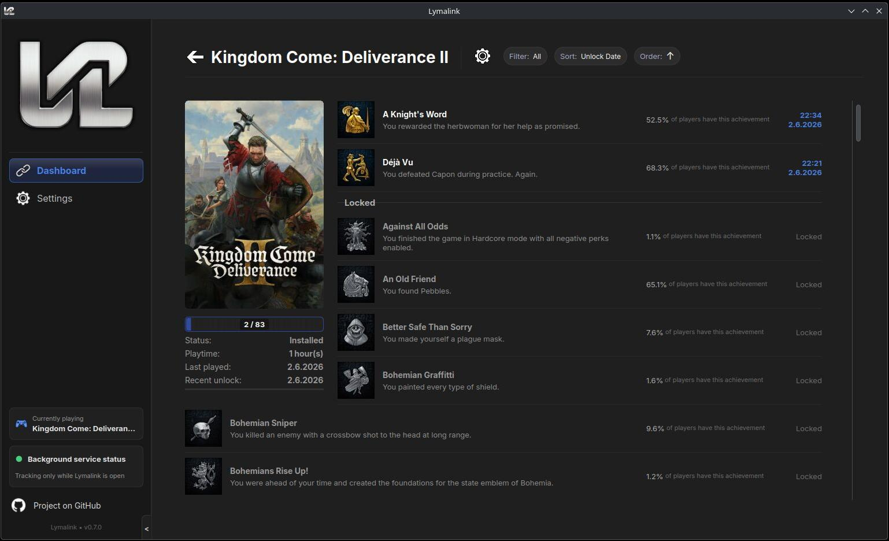
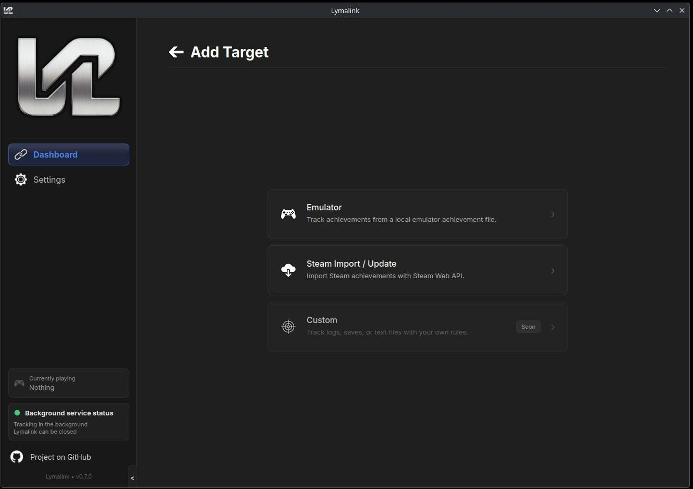
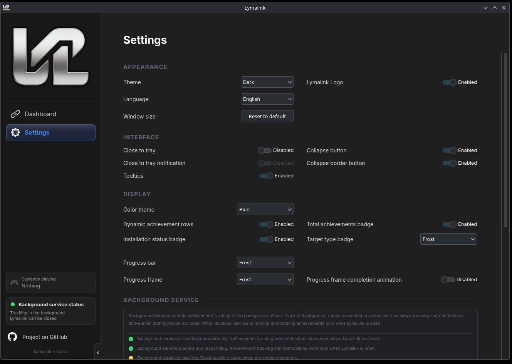
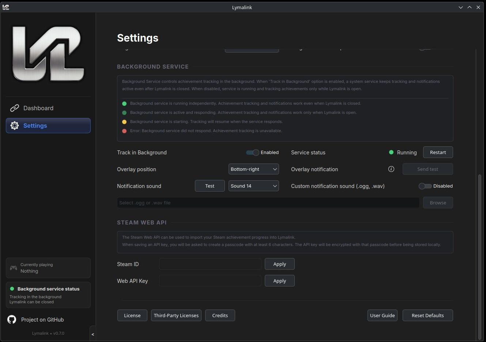

# Lymalink

**Achievement tracker for Steam emulators, Steam/Cloud APIs, and fully custom targets.**

> The **v0.8.0-beta** release is now available for Linux. See the [Installation](#installation) section to get started, explore the [Features](#features) to see what's included, and consult the [User Guide](frontend/res/docs/help/user-guide-0.8.0-beta.md) for configuration, usage instructions, and FAQ.

> **Note:** Lymalink is currently under active development. If you encounter any bugs or unexpected behavior, your feedback is highly appreciated, please report them by opening an issue on [Issues](https://github.com/Morsomus/Lymalink/issues).

## Overview

Lymalink is a cross-platform application designed to monitor local game achievement files and synchronize data through cloud APIs. It provides a unified solution for tracking milestones across local achievement files and official environments alike. Beyond gaming, the platform offers the flexibility to create custom achievements which can be tracked from various sources. At its core runs a lightweight background daemon (`lymalinkd`) responsible for file monitoring and delivering in-game overlay notifications when achievements are detected.

The frontend provides a clean interface for viewing progress and managing settings, but is entirely optional. Once configured through the frontend, the daemon can run independently in the background without it. For users who prefer tighter control, Lymalink can also be configured to require the frontend to be open before the daemon is permitted to run.

## Table of Contents

- [Visual Showcase](#visual-showcase)
- [Features](#features)
- [Installation](#installation)
  - [Option 1: Pre-built Release (Recommended for Supported Distros)](#option-1-pre-built-release-recommended-for-supported-distros)
  - [Option 2: Building from Source](#option-2-building-from-source)
- [Project Status](#project-status)
- [Planned Features](#planned-features)
- [Building for Linux](#building-for-linux)
  - [Frontend](#frontend)
  - [Backend](#backend)
  - [Backend Overlay](#backend-overlay)
  - [Installer](#installer)
- [Credits](#credits)
- [Disclaimer](#disclaimer)
  - [General](#general)
  - [Steam Based Achievement File Support](#steam-based-achievement-file-support)
  - [Official Steam API / User Data](#official-steam-api--user-data)
  - [No Warranty](#no-warranty)

## Visual Showcase

| |
|:---:|
|  |
| *My Summer Car by Amistech Games. Lymalink is not affiliated with Amistech Games. Please support the developers by buying their products.* |

### Dashboard Layouts
| Default Card View | Small Card View |
|:---:|:---:|
|  |  |

| Details View | List View |
|:---:|:---:|
|  |  |

### Target Management
| Target Details |
|:---:|
|  |

| Add Target | Achievement Progress |
|:---:|:---:|
|  |  |

### Settings
|  |  |
|:---:|:---:|
|  |  |


## Features

> **v0.8.0-beta** release.

- **Background tracking** - Track achievements in the background when enabled, without requiring the frontend UI to stay open.
- **Overlay notifications** - Display achievement notifications as overlays with six configurable screen positions.
- **Custom notification sounds** - Choose from multiple notification sound tracks or add your own.
- **Playtime tracking** - Track playtime for your targets.
- **Multiple dashboard layouts** - View tracked targets using several dashboard layout options.
- **Target organization** - Sort, filter, and search tracked targets.
- **Manual achievement control** - Manually unlock or lock achievements when needed.
- **Customizable interface** - Configure card styles, show or hide UI elements, and adjust color themes from settings.
- **System tray support** - Keep Lymalink accessible from the system tray.
- **Steam achievement import** - Import your personal Steam achievements to the dashboard.

## Installation

Lymalink can be installed either by using the pre-built installer or by compiling the binaries manually from source if your Linux distribution has compatibility issues with the pre-made packages.

> **Important:** Post-installation, please consult the [User Guide](frontend/res/docs/help/user-guide-0.8.0-beta.md#-achievement-notifications) for initial setup steps, specifically regarding the launcher-specific configuration required to ensure the in-game achievement overlay works correctly.

### Option 1: Pre-built Release (Recommended for Supported Distros)

Download the latest `lymalink-installer-<VERSION>-<DISTRO_VERSION>-x86_64.run` from the [Releases](https://github.com/Morsomus/Lymalink/releases) page.

```bash
chmod +x lymalink-installer-*.run
./lymalink-installer-*.run
```

**Please follow the instructions provided by the installer. If prompted, install any missing system dependencies required by the installer to ensure the installation can be successfully completed.**

> **Note:** To uninstall while keeping your configuration and achievement data files, run `~/.local/bin/uninstall-lymalink`.

### Option 2: Building from Source

```bash
git clone https://github.com/Morsomus/Lymalink.git
cd Lymalink
```

Install the required dependencies for your specific Linux distribution (the documentation outlines Ubuntu equivalents):

* **Frontend:** [frontend/README.md#dependencies](frontend/README.md#dependencies)
* **Backend:** [backend/README.md#dependencies](backend/README.md#dependencies)
* **Backend Overlay:** [backend-overlay/README.md#dependencies](backend-overlay/README.md#dependencies)
* **Installer Requirements:** [installer/README.md#build-requirements](installer/README.md#build-requirements)

```bash
installer/build.sh
./installer/build/lymalink-installer-0.8.0-*-x86_64.run
```


## Project Status

Current progress towards different versions, platform-wise

### Linux
| Component | Status<br>v0.8.0-beta | Milestone |
|-----------|--------|--------|
| **Frontend** | 🚧 In Development | v1.0.0 |
| &nbsp;&nbsp;&nbsp;&nbsp;Side Navigation Bar | ✅ Ready to Deploy | v0.8.0-beta |
| &nbsp;&nbsp;&nbsp;&nbsp;Side Navigation Bar Business Logic | ✅ Ready to Deploy | v0.8.0-beta |
| &nbsp;&nbsp;&nbsp;&nbsp;Settings | ✅ Ready to Deploy | v0.8.0-beta |
| &nbsp;&nbsp;&nbsp;&nbsp;Settings Business Logic | ✅ Ready to Deploy | v0.8.0-beta |
| &nbsp;&nbsp;&nbsp;&nbsp;Dashboard | ✅ Ready to Deploy | v0.8.0-beta |
| &nbsp;&nbsp;&nbsp;&nbsp;Dashboard Business Logic | ✅ Ready to Deploy | v0.8.0-beta |
| &nbsp;&nbsp;&nbsp;&nbsp;Achievement Progress Details | ✅ Ready to Deploy | v0.8.0-beta |
| &nbsp;&nbsp;&nbsp;&nbsp;Achievement Progress Details Business Logic | ✅ Ready to Deploy | v0.8.0-beta |
| &nbsp;&nbsp;&nbsp;&nbsp;Statistics | 🔴 To Be Started | v0.9.0-beta |
| &nbsp;&nbsp;&nbsp;&nbsp;Statistics Business Logic | 🔴 To Be Started | v0.9.0-beta |
| &nbsp;&nbsp;&nbsp;&nbsp;Localisation | 🔴 To Be Started | |
| **Backend Service** | 🚧 In Development | v1.0.0 |
| &nbsp;&nbsp;&nbsp;&nbsp;Core Functionality | ✅ Ready to Deploy | v0.8.0-beta |
| &nbsp;&nbsp;&nbsp;&nbsp;Local Achievement File Support | 🚧 In Development | v1.0.0 |
| &nbsp;&nbsp;&nbsp;&nbsp;Notification Sound System | ✅ Ready to Deploy | v0.8.0-beta |
| &nbsp;&nbsp;&nbsp;&nbsp;Notification Overlay (Vulkan, OpenGL) | ✅ Ready to Deploy | v0.8.0-beta |
| **Compatibility & Testing** | 🚧 In Development | v1.0.0 |
| &nbsp;&nbsp;&nbsp;&nbsp;Distribution Compatibility | 🚧 In Development | v1.0.0 |

### Windows
| Component | Status |
|-----------|--------|
| Frontend | 🔴 To Be Started |
| Backend Service | 🔴 To Be Started |

---

## Planned Features

> The following features are planned and subject to change. Core tracking functionality is not listed here.

- **Multiple Profiles** - Switch between independent profiles. Useful for tracking a fresh playthrough, a challenge run, or simply keeping accounts separate.
- **Customizable UI** - Languages to choose from, switch between dark, light, and system themes to suit your preference and much more.
- **Export & Import** - Move your achievement data between devices or back it up in open formats such as JSON or CSV.
- **Achievement Reports (Multiple file formats)** - Generate shareable summaries for a single title or a selection of titles. A clean, exportable snapshot of your achievements.

---

## Building for Linux

- [Frontend build guide](frontend/README.md)
- [Backend build guide](backend/README.md)
- [Backend overlay build guide](backend-overlay/README.md)
- [Installer build guide](installer/README.md)

### Frontend

The Qt frontend can be built with `frontend/build.sh` from the repository root:

```bash
frontend/build.sh clean
frontend/build.sh debug
frontend/build.sh release
frontend/build.sh deploy
frontend/build.sh deploy --debug
frontend/build.sh uninstall
frontend/build.sh dev
frontend/build.sh test
frontend/build.sh test --silent
```

For frontend setup, direct CMake usage, tests, and deployment details, see [frontend/README.md](frontend/README.md).

### Backend

`lymalinkd` is the Linux backend daemon. It can be built with `backend/build.sh` from the repository root:

```bash
backend/build.sh clean
backend/build.sh debug
backend/build.sh release
backend/build.sh test
backend/build.sh test --silent
backend/build.sh deploy
backend/build.sh deploy --debug
backend/build.sh start
backend/build.sh stop
backend/build.sh restart
backend/build.sh status
backend/build.sh logs
backend/build.sh uninstall
```

For backend setup, direct `make` usage, tests, local run commands, and service details, see [backend/README.md](backend/README.md).

### Backend Overlay

The standalone overlay libraries can be built and deployed separately:

```bash
backend-overlay/build.sh clean
backend-overlay/build.sh debug
backend-overlay/build.sh release
backend-overlay/build.sh flatpak-debug
backend-overlay/build.sh flatpak-release
backend-overlay/build.sh deploy
backend-overlay/build.sh deploy --debug
backend-overlay/build.sh uninstall
```

For overlay setup, Flatpak SDK setup, direct `make` usage, and deployment details, see [backend-overlay/README.md](backend-overlay/README.md).

### Installer

The `installer/build.sh` script builds the frontend, backend, overlay libraries, Flatpak VulkanLayer extension, and a self-extracting user-level installer:

```bash
installer/build.sh
```

For installer host requirements, Flatpak SDK setup, manual Qt runtime bundling, and packaging details, see [installer/README.md](installer/README.md).

Installer output is written to:

```text
installer/build/lymalink-release/
installer/build/lymalink-installer-<VERSION>-<DISTRO_VERSION>-x86_64.run
```

Chmod +x and run the generated `.run` file to install Lymalink without root. To remove installer-managed files while preserving user configuration and database data, run:

```bash
~/.local/bin/uninstall-lymalink
```

---

## Credits
See [CREDITS.md](frontend/res/docs/CREDITS.md) for third-party sound assets used in this project.

## Disclaimer

### General

Lymalink is an independent, open-source project and is **not affiliated with, authorized by, maintained by, sponsored by, or endorsed by** Valve Corporation, Steam, GOG, or any other platform, company, or service referenced in this software.

All trademarks, service marks, trade names, logos, and brand assets mentioned or displayed in this project are the property of their respective owners. Their use here is solely for identification and reference purposes and does not imply any association with or endorsement by those owners.

### Steam Based Achievement File Support

Lymalink is capable of reading local achievement data files generated by third-party tools, Steam emulators, or the users themselves. This functionality is provided **strictly for personal, informational use**.

This software:
- Does **not** provide, distribute, or assist in obtaining Steam emulators
- Does **not** interact with Steam or any platform service beyond explicit API calls made by the user
- Does **not** bypass any digital rights management (DRM) system or platform protection
- Is **not** affiliated with or associated with any scene group, cracking group, or piracy community

The authors of this project do not condone or support any illegal activity. Users are solely responsible for ensuring their use of this software complies with applicable laws and the terms of service of any platform they interact with.

### Official Steam API / User Data

Lymalink supports importing a user's own Steam achievement data via the official Steam Web API. This feature requires the user to supply their own Steam Web API key, obtained directly from Valve. No Steam credentials or private data are collected, stored, or transmitted by this application beyond what the user explicitly configures.

For more information on obtaining a Steam Web API key, see: https://steamcommunity.com/dev/apikey

### No Warranty

This software is provided **as-is**, without any express or implied warranty. In no event shall the authors be held liable for any damages arising from the use of, or inability to use, this software.
