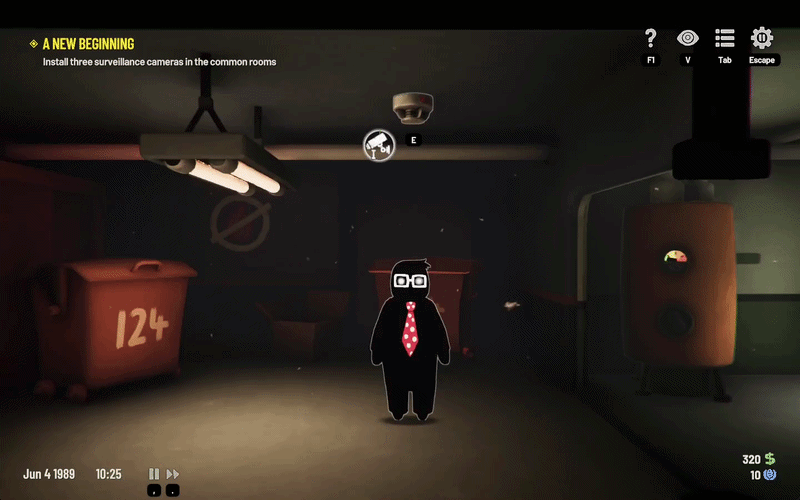
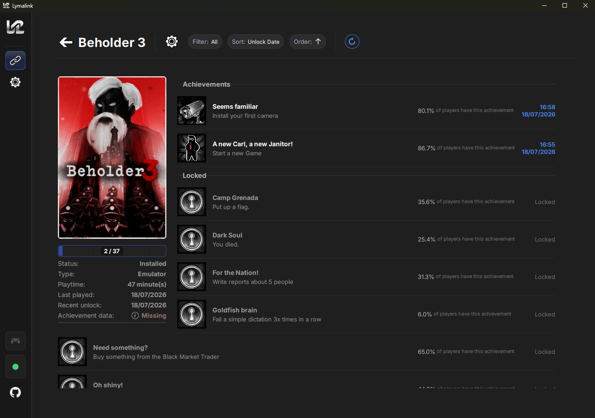
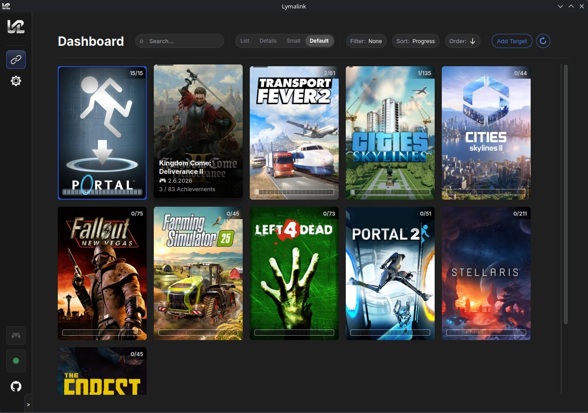
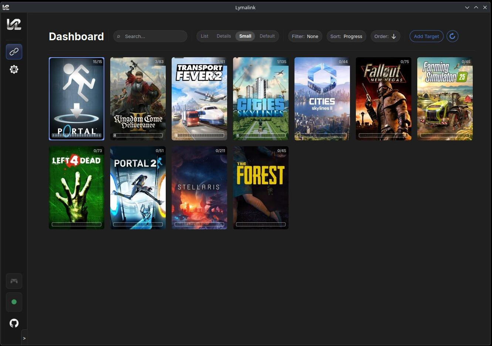
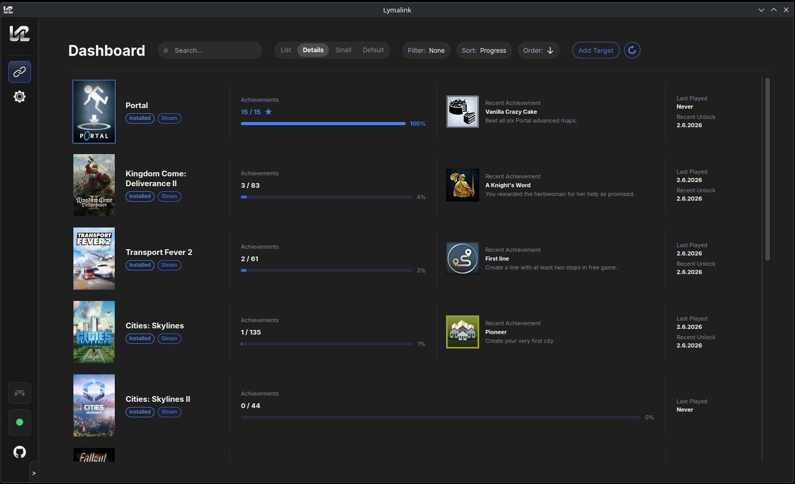
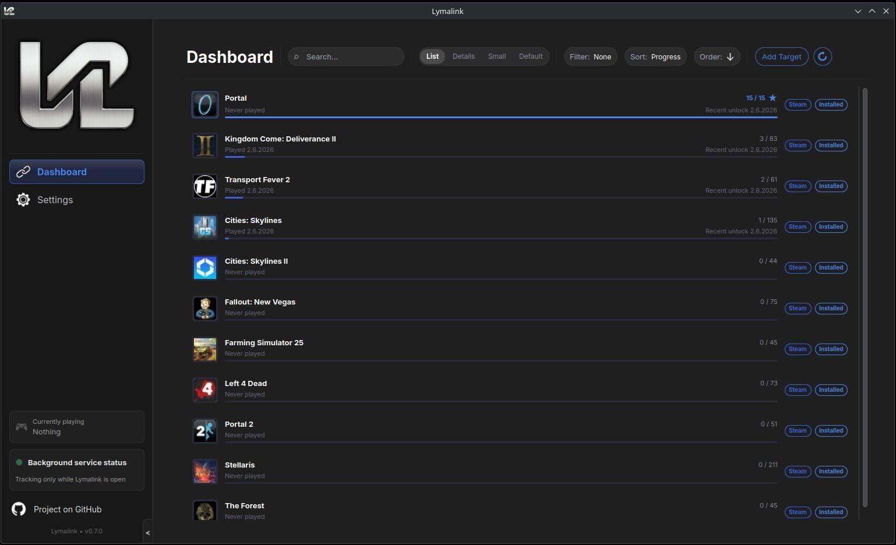
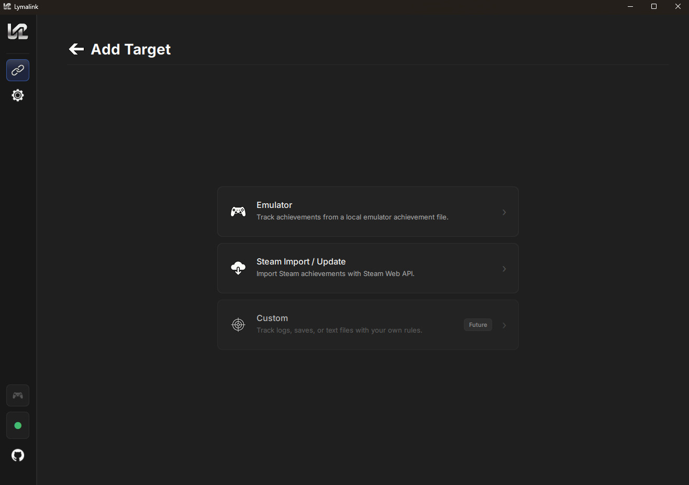
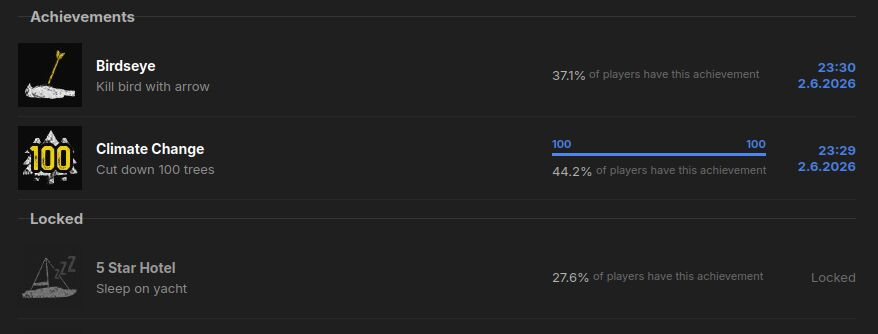
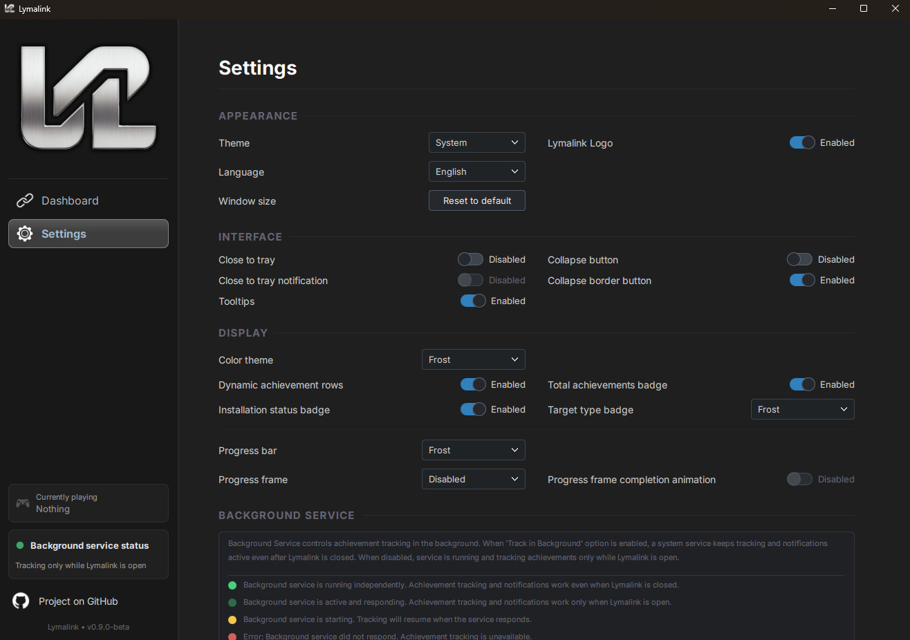
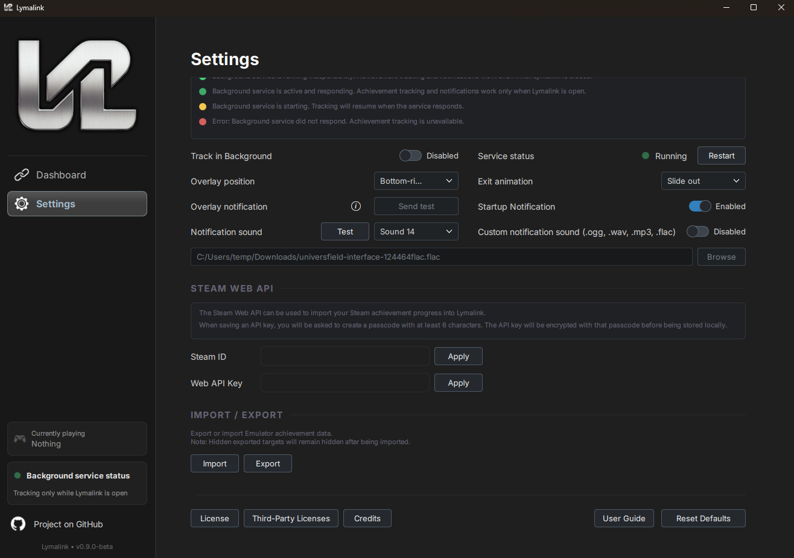

# Lymalink

**An achievement watcher and tracker for personal Steam achievement imports, as well as Steam and GOG emulators.**

- Reads local achievement files created by Steam and GOG emulators during gameplay and triggers achievement unlock notifications.
- Can be configured to run in the background without the user interface.
- Import your official Steam achievements.

> The **v0.9.*-beta** release is available for **Linux** and **Windows**. See [Installation - Linux](#installation---linux) or [Installation - Windows](#installation---windows) to get started and consult the [Linux](frontend/res/docs/help/user-guide-0.9.x-beta-linux.md) or [Windows](frontend/res/docs/help/user-guide-0.9.x-beta-win.md) user guide for configuration, usage instructions, and FAQ.

> **Note:** Lymalink is currently under active development. If you encounter any bugs or unexpected behavior, your feedback is highly appreciated, please report them by opening an issue on [Issues](https://github.com/Morsomus/Lymalink/issues).

### Implemented Features

- **Tracking Emulator Achievements** - Support achievement files created by Goldberg, Rune/Codex, RELOADED, SmartSteamEmu, Tenoke, NemirtingasGalaxyEmulator 1.4.2/1.9.2.
- **Background tracking** - Track achievements in the background when enabled, without requiring the frontend UI to stay open.
- **Overlay notifications** - Display achievement notifications as overlays with six configurable screen positions with customizable animation.
- **Custom notification sounds** - Choose from multiple notification sound tracks or add your own.
- **Playtime tracking** - Track playtime for your targets.
- **Multiple dashboard layouts** - View tracked targets using several dashboard layout options.
- **Target organization** - Sort, filter, and search tracked targets.
- **Manual achievement control** - Manually unlock or lock achievements when needed.
- **Customizable interface** - Configure card styles, show or hide UI elements, and adjust color themes from settings.
- **System tray support** - Keep Lymalink accessible from the system tray.
- **Export & Import** - Move your achievement data between devices or back it up in JSON format.
- **Steam achievement import** - Import your personal Steam achievements to the dashboard.

## Visual Showcase



*Beholder 3 by Paintbucket Games. Lymalink is not affiliated with Paintbucket Games. Please support the developers by buying their products.*

### Achievements


### Dashboard Layouts
| Default Card View | Small Card View |
|:---:|:---:|
|  |  |

| Details View | List View |
|:---:|:---:|
|  |  |

### Target Management
| Add Target | Achievement Progress |
|:---:|:---:|
|  |  |

### Settings
|  |  |
|:---:|:---:|
|  |  |

## Table of Contents

- [Installation - Linux](#installation---linux)
  - [Option 1: Pre-built Release (Recommended for Supported Distros)](#option-1-pre-built-release-recommended-for-supported-distros)
  - [Option 2: Building from Source](#option-2-building-from-source)
- [Installation - Windows](#installation---windows)
  - [Option 1: Pre-built Release](#option-1-pre-built-release)
  - [Option 2: Building from Source](#option-2-building-from-source-1)
- [Project Status](#project-status)
- [Planned Features](#planned-features)
- [Building](#building)
  - [Frontend](#frontend)
  - [Backend](#backend)
  - [Backend Overlay](#backend-overlay)
  - [Linux Installer](#linux-installer)
  - [Windows Installer](#windows-installer)
- [Credits](#credits)
- [Disclaimer](#disclaimer)
  - [General](#general)
  - [Steam Based Achievement File Support](#steam-based-achievement-file-support)
  - [Official Steam API / User Data](#official-steam-api--user-data)
  - [No Warranty](#no-warranty)

## Installation - Linux

Lymalink can be installed either by using the pre-built installer or by compiling the binaries manually from source if your Linux distribution has compatibility issues with the pre-made packages.

> **Important:** Post-installation, please consult the [User Guide](frontend/res/docs/help/user-guide-0.9.x-beta-linux.md#-achievement-notifications) for initial setup steps, specifically regarding the launcher-specific configuration required to ensure the in-game achievement overlay works correctly.

### Option 1: Pre-built Release (Recommended for Supported Distros)

Download the latest `lymalink-installer-<VERSION>-<DISTRO_VERSION>-x86_64.run` from the [Releases](https://github.com/Morsomus/Lymalink/releases) page.

```bash
chmod +x lymalink-installer-*.run
./lymalink-installer-*.run
```

**Please follow the instructions provided by the installer. If additional dependencies are required, install them and re-run the installer until installation completes successfully.**

> **Note:** To uninstall while keeping your configuration and achievement data files, run `~/.local/bin/uninstall-lymalink`.

> **Note:** To update an existing installation, run the latest installer. User data and configuration will be preserved.

### Option 2: Building from Source

```bash
git clone --depth 1 --branch v0.9.2-beta https://github.com/Morsomus/Lymalink.git
cd Lymalink
```

Install the required dependencies for your specific Linux distribution (the documentation outlines Ubuntu equivalents):

* **Frontend:** [frontend/README.md#dependencies](frontend/README.md#dependencies)
* **Backend:** [backend/README.md#dependencies](backend/README.md#dependencies)
* **Backend Overlay:** [backend-overlay/README.md#dependencies](backend-overlay/README.md#dependencies)
* **Linux Installer Requirements:** [installer/linux/README.md#build-requirements](installer/linux/README.md#build-requirements)

```bash
installer/linux/build.sh
./installer/linux/build/lymalink-installer-0.9.2-*-x86_64.run
```

## Installation - Windows

> After installation, consult the [Windows User Guide](frontend/res/docs/help/user-guide-0.9.x-beta-win.md#-achievement-notifications) for usage information.

### Option 1: Pre-built Release

Download the latest `lymalink-installer-<VERSION>-win-x64.exe` from the [Releases](https://github.com/Morsomus/Lymalink/releases) page and run it.

> **Note:** To uninstall while keeping your configuration and achievement data files, use Windows Installed apps or run `& "$env:LOCALAPPDATA\Programs\Lymalink\uninstall-lymalink.exe"` in PowerShell.

> **Note:** To update an existing installation, run the latest installer. User data and configuration under `%APPDATA%\Lymalink` will be preserved.

### Option 2: Building from Source

```powershell
git clone --depth 1 --branch v0.9.2-beta https://github.com/Morsomus/Lymalink.git
cd Lymalink
```

Install the Windows dependencies documented for each component:

* **Frontend:** [frontend/README.md#dependencies-1](frontend/README.md#dependencies-1)
* **Backend:** [backend/README.md#dependencies-1](backend/README.md#dependencies-1)
* **Backend Overlay:** [backend-overlay/README.md#dependencies-1](backend-overlay/README.md#dependencies-1)
* **Windows Installer Requirements:** [installer/windows/README.md#build-requirements](installer/windows/README.md#build-requirements)

```powershell
Set-ExecutionPolicy -Scope Process Bypass
.\installer\windows\build.ps1
.\installer\windows\build\lymalink-installer-0.9.2-win-x64.exe
```


## Project Status

Current progress towards different versions, platform-wise

### Linux
| Component | Status<br>v0.8.0-beta | Status<br>v0.9.0-beta | Milestone |
|-----------|--------|--------|--------|
| **Frontend** | | | |
| &nbsp;&nbsp;&nbsp;&nbsp;Side Navigation Bar | ✅ Ready to Deploy | - | v0.8.0-beta |
| &nbsp;&nbsp;&nbsp;&nbsp;Side Navigation Bar Business Logic | ✅ Ready to Deploy | - | v0.8.0-beta |
| &nbsp;&nbsp;&nbsp;&nbsp;Settings | ✅ Ready to Deploy | - | v0.8.0-beta |
| &nbsp;&nbsp;&nbsp;&nbsp;Settings Business Logic | ✅ Ready to Deploy | - | v0.8.0-beta |
| &nbsp;&nbsp;&nbsp;&nbsp;Dashboard | ✅ Ready to Deploy | - | v0.8.0-beta |
| &nbsp;&nbsp;&nbsp;&nbsp;Dashboard Business Logic | ✅ Ready to Deploy | - | v0.8.0-beta |
| &nbsp;&nbsp;&nbsp;&nbsp;Achievement Progress Details | ✅ Ready to Deploy | - | v0.8.0-beta |
| &nbsp;&nbsp;&nbsp;&nbsp;Achievement Progress Details Business Logic | ✅ Ready to Deploy | - | v0.8.0-beta |
| &nbsp;&nbsp;&nbsp;&nbsp;Statistics | - | 🔴 To Be Started | v0.9.x-beta |
| &nbsp;&nbsp;&nbsp;&nbsp;Statistics Business Logic | - | 🔴 To Be Started | v0.9.x-beta |
| &nbsp;&nbsp;&nbsp;&nbsp;Localisation | - | 🔴 To Be Started | v1.x.x |
| **Backend Service** | | | |
| &nbsp;&nbsp;&nbsp;&nbsp;Core Functionality | ✅ Ready to Deploy | - | v0.8.0-beta |
| &nbsp;&nbsp;&nbsp;&nbsp;Local Achievement File Support | 🚧 In Development | - | v1.0.0 |
| &nbsp;&nbsp;&nbsp;&nbsp;Notification Sound System | ✅ Ready to Deploy | - | v0.8.0-beta |
| &nbsp;&nbsp;&nbsp;&nbsp;Notification Overlay (Vulkan, OpenGL) | ✅ Ready to Deploy | - | v0.8.0-beta |
| **Compatibility & Testing** | | | |
| &nbsp;&nbsp;&nbsp;&nbsp;Distribution Compatibility | 🚧 In Development | - | v1.0.0 |
| &nbsp;&nbsp;&nbsp;&nbsp;Notification Overlay Compatibility Issues | 🚧 In Development | - | v1.0.0 |

### Windows
| Component | Status<br>v0.9.0-beta | Milestone |
|-----------|--------|--------|
| **Frontend** | | |
| &nbsp;&nbsp;&nbsp;&nbsp;Initial port | ✅ Ready to Deploy | v0.9.0-beta |
| **Backend Service** | | |
| &nbsp;&nbsp;&nbsp;&nbsp;Initial port | ✅ Ready to Deploy | v0.9.0-beta |
| &nbsp;&nbsp;&nbsp;&nbsp;Notification Overlay (Vulkan, OpenGL, DX9-12) | ✅ Ready to Deploy | v0.9.0-beta |
| **Compatibility & Testing** | | |
| &nbsp;&nbsp;&nbsp;&nbsp;Notification Overlay Compatibility Issues | 🚧 In Development | v1.0.0 |

---

## Planned Features

> The following features are planned and subject to change. Core tracking functionality is not listed here.

- **Additional Emulator Support** - Expand support for more emulator achievement formats and related local achievement file structures.
- **Steam Import Auto-Update** - Selectively refresh imported Steam achievement data to keep tracked progress up to date without user intervention.
- **Achievement Reports (Multiple file formats)** - Generate shareable summaries for a single title or a selection of titles. A clean, exportable snapshot of your achievements.
- **Localisation** - Languages to choose from.
- **Custom Targets** - Create and track achievements outside predefined game or platform integrations. Useful for personal milestones, challenge runs, custom game setups, and other progress-tracking workflows.

---

## Building

Use the `.sh` build scripts on Linux and the `.ps1` build scripts in Windows PowerShell.

1. [Frontend build guide](frontend/README.md)
2. [Backend build guide](backend/README.md)
3. [Backend overlay build guide](backend-overlay/README.md)
4. [Linux installer build guide](installer/linux/README.md)
5. [Windows installer build guide](installer/windows/README.md)

### Frontend

The Qt frontend can be built with `frontend/build.sh` on Linux or `frontend/build.ps1` on Windows from the repository root:

```bash
frontend/build.sh/ps1 clean
frontend/build.sh/ps1 debug
frontend/build.sh/ps1 release
frontend/build.sh/ps1 deploy
frontend/build.sh/ps1 deploy --debug
frontend/build.sh/ps1 uninstall
frontend/build.sh/ps1 dev
frontend/build.sh/ps1 test
frontend/build.sh/ps1 test --silent
```

For Linux and Windows frontend setup, direct CMake usage, tests, and deployment details, see [frontend/README.md](frontend/README.md).

### Backend

`lymalinkd` is the backend service. It can be built with `backend/build.sh` on Linux or `backend/build.ps1` on Windows from the repository root:

```bash
backend/build.sh/ps1 clean
backend/build.sh/ps1 debug
backend/build.sh/ps1 release
backend/build.sh/ps1 deploy
backend/build.sh/ps1 deploy --debug
backend/build.sh/ps1 start
backend/build.sh/ps1 stop
backend/build.sh/ps1 restart
backend/build.sh/ps1 status
backend/build.sh/ps1 logs
backend/build.sh/ps1 uninstall
backend/build.sh test
backend/build.sh test --silent
```

For Linux and Windows backend setup, direct build usage, tests, local run commands, and service details, see [backend/README.md](backend/README.md).

### Backend Overlay

The standalone overlay libraries can be built and deployed with `backend-overlay/build.sh` on Linux or `backend-overlay/build.ps1` on Windows from the repository root:

```bash
backend-overlay/build.sh/ps1 clean
backend-overlay/build.sh/ps1 debug
backend-overlay/build.sh/ps1 release
backend-overlay/build.sh/ps1 deploy
backend-overlay/build.sh/ps1 deploy --debug
backend-overlay/build.sh/ps1 uninstall
backend-overlay/build.sh flatpak-debug
backend-overlay/build.sh flatpak-release
```

For Linux overlay setup, Flatpak SDK setup, and direct `make` usage, and for Windows Vulkan/Direct3D setup and deployment details, see [backend-overlay/README.md](backend-overlay/README.md).

### Linux Installer

The `installer/linux/build.sh` script builds the frontend, backend, overlay libraries, Flatpak VulkanLayer extension, and a self-extracting user-level Linux installer:

```bash
installer/linux/build.sh
```

For installer host requirements, Flatpak SDK setup, manual Qt runtime bundling, and packaging details, see [installer/linux/README.md](installer/linux/README.md).

Installer output is written to:

```text
installer/linux/build/lymalink-release/
installer/linux/build/lymalink-installer-<VERSION>-<DISTRO_VERSION>-x86_64.run
```

Chmod +x and run the generated `.run` file to install Lymalink without root. To remove installer-managed files while preserving user configuration and database data, run:

```bash
~/.local/bin/uninstall-lymalink
```

### Windows Installer

The `installer/windows/build.ps1` script builds the frontend, backend, x64/x86 overlay libraries, stages the Qt runtime with `windeployqt`, and creates a per-user NSIS installer:

```powershell
Set-ExecutionPolicy -Scope Process Bypass
.\installer\windows\build.ps1
```

To clean the Windows installer build directory:

```powershell
Set-ExecutionPolicy -Scope Process Bypass
.\installer\windows\build.ps1 clean
```

For Windows installer host requirements, NSIS setup, payload layout, registry entries, and packaging details, see [installer/windows/README.md](installer/windows/README.md).

Installer output is written to:

```text
installer/windows/build/lymalink-release/
installer/windows/build/lymalink-installer-<VERSION>-win-x64.exe
```

Run the generated `.exe` file to install Lymalink for the current Windows user. To remove installer-managed files while preserving user configuration and database data, uninstall from Windows Installed apps or run:

```powershell
& "$env:LOCALAPPDATA\Programs\Lymalink\uninstall-lymalink.exe"
```

---

## Credits
See [CREDITS.md](frontend/res/docs/CREDITS.md) for third-party sound assets used in this project.

## Disclaimer

### General

Lymalink is an independent, open-source project and is **not affiliated with, authorized by, maintained by, sponsored by, or endorsed by** Valve Corporation, Steam, GOG, or any other platform, company, or service referenced in this software.

All trademarks, service marks, trade names, logos, and brand assets mentioned or displayed in this project are the property of their respective owners. Their use here is solely for identification and reference purposes and does not imply any association with or endorsement by those owners.

### Steam Based Achievement File Support

Lymalink is capable of reading local achievement data files generated by third-party tools, Steam emulators, or the users themselves. This functionality is provided **strictly for personal, informational use**.

This software:
- Does **not** provide, distribute, or assist in obtaining Steam emulators
- Does **not** interact with Steam or any platform service beyond explicit API calls made by the user
- Does **not** bypass any digital rights management (DRM) system or platform protection
- Is **not** affiliated with or associated with any scene group, cracking group, or piracy community

The authors of this project do not condone or support any illegal activity. Users are solely responsible for ensuring their use of this software complies with applicable laws and the terms of service of any platform they interact with.

### Official Steam API / User Data

Lymalink supports importing a user's own Steam achievement data via the official Steam Web API. This feature requires the user to supply their own Steam Web API key, obtained directly from Valve. No Steam credentials or private data are collected, stored, or transmitted by this application beyond what the user explicitly configures.

For more information on obtaining a Steam Web API key, see: https://steamcommunity.com/dev/apikey

### No Warranty

This software is provided **as-is**, without any express or implied warranty. In no event shall the authors be held liable for any damages arising from the use of, or inability to use, this software.
